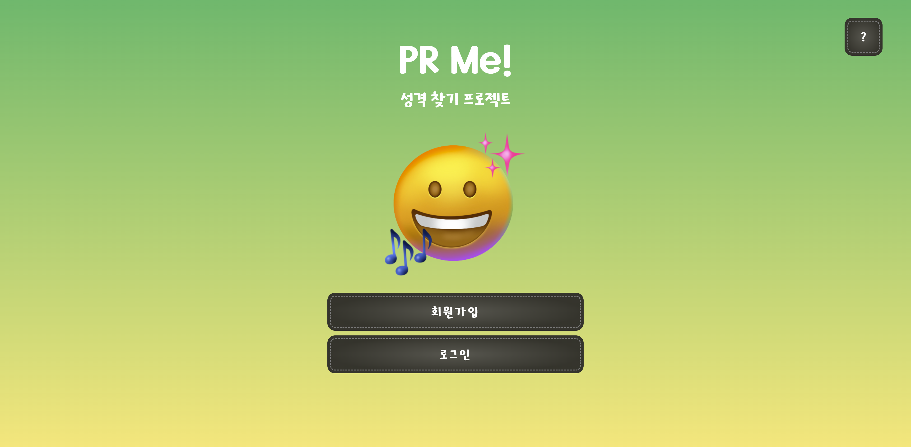

# PR Me! - 성격 테스트 프로젝트
React + Node.js + MySQL을 이용한 Web Project 입니다.
  

## 🖥️ 프로젝트 소개
피알미는 개인의 진짜 성격을 파악하기 위한 성격 테스트 프로그램입니다. 
다른 일반적인 MBTI 성격 테스트와는 달리, 피알미는 개인이 바라는 이상적인 모습과 친구들이 보는 실제 성격을 비교하여 진정한 성격을 밝혀냅니다. 
이를 통해 개인은 주관적인 테스트 결과와 객관적인 관찰 결과를 비교함으로써, 자신의 진짜 성격에 대해 더욱 정확한 인사이트를 얻을 수 있게 됩니다. 
피알미는 개인의 자아를 파악하고, 성장과 발전을 위한 기반을 마련하는 도구로 사용될 수 있습니다.

 

### 🕰️ 개발 기간
- 2023.05.15 ~ 2023.06.15 (진행중)

 

### 👩🏻‍💻 조원 소개
- 홍세빈 : React를 이용한 프론드엔드 개발

- 윤다빈 : Node.js를 이용한 백엔드 개발

 

### 🛠️ 개발 환경
- 
Frontend 

&nbsp;&nbsp;&nbsp;&nbsp;&nbsp;

- 
Backend 

&nbsp;&nbsp;&nbsp;&nbsp;&nbsp;

- 
Database 

&nbsp;&nbsp;&nbsp;&nbsp;&nbsp;

- 
VCS

&nbsp;&nbsp;&nbsp;&nbsp;&nbsp;

- 
Editor 

&nbsp;&nbsp;&nbsp;&nbsp;&nbsp;

- 
API 

&nbsp;&nbsp;&nbsp;&nbsp;&nbsp;

- 
ETC 

&nbsp;&nbsp;&nbsp;&nbsp;&nbsp;

  

## 🦾 주요 기능
- 내가 하는 내 성격 테스트
- 친구가 하는 내 성격 테스트
- 두 테스트 비교 후 하나의 결과 도출

 
+ 피알미 접속 시 첫 페이지 

 

## 📑 PR Me! 사용법
- npm start